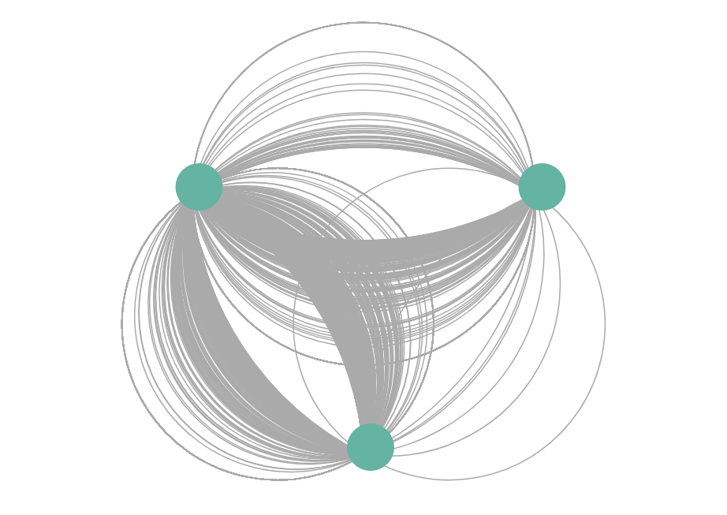

# why-fi

This is a position tracking software based on wi-fi signals. It's alpha quality, meaning it's not fancy or smooth by any means. If you intend to use this, be prepared to get yout hands dirty.

I've presented this work at the Mozilla Festival 2019 in London. If you're looking for the slides, [download them here](https://laury.me/talks/mozfest2019/why-fi.pdf).

You can also take a look at the original proof of concept [here](lab/Device_proximity_parser.ipynb). It's a simple Python code that takes wi-fi packets and extracts RSSI data (signal strength) from each one. Everything else on this project builds up on top of the following premise: if we can measure the signal strength of a device in relation to a receiver, we can map its position over time.

# How to use this project
The work will involve three steps:
1. [collect the wi-fi packets](#how-to-capture-packets)
2. [filter and process the data to turn it into a table of movements](#process-the-packets)
3. [visualize the movements in a web browser](#visualize-the-data)

To do this, you need to have a working knowledge of:
- Linux
- SSH
- Python/Jupyter
- Javascript
- Docker (not required, but recommended)

## How to capture packets
Until now, I have used Raspberry Pi 3B with great results. Certainly, you can use other Raspberry Pi models, or even completely different hardware for this step. All you realy need is a hardware capable of running [airodump-ng](https://tools.kali.org/wireless-attacks/airodump-ng).

### Raspberry Pi 3B
There is a [helper script](https://github.com/laurybueno/why-fi/blob/master/scripts/packet_collect.sh) that you can use to ease the data collection process. In essence, its just a way to juggle `airodump-ng` functionality and the regular wi-fi functionality. You won't need it if you can connect to the Pi using an ethernet cable or keyboard/screen during the data gathering process.

First, download the "Kali Linux Raspberry Pi 2 (v1.2), 3 and 4 64-Bit" from [here](https://offensive-security.com/kali-linux-arm-images/).

Now, flash it to a SDCard and boot it in your Raspberry Pi 3B. If you need help with that, take a look [here](https://www.raspberrypi.org/documentation/installation/installing-images/).

Copy the [helper script](https://github.com/laurybueno/why-fi/blob/master/scripts/packet_collect.sh) to Kali's home directory and run:

```
cd ~
chmod +x packet_collect.sh
sudo ./packet_collect.sh
```

Since the airodump will use the wi-fi hardware, any connection through it will drop. The captured packets file name will have the following format 'rasp-<local_mac_addr>-<job_start_time>.cap'.

The script will blink the Pi's leds to let you know if everything is working as intended. The "color code" is as follows
- __red and green blinking separately__: everything is working fine and the data is being collected
- __red and green blinking together__: something went wrong with airodump, but the helper script took notice and restored the wi-fi functionality, so you can use SSH to figure out what went wrong
- __red and green on together (no blinking)__: the packet collection process went fine and the script exited normally; wi-fi functionality is restored and you can use SSH to get the file

Any combination different from the above probably means that the data collection process has gone wrong and the helper script have failed to notice it. In this case, reboot the Pi to recover network functionality (or plug an ethernet cable).

## Process the packets
Enter the `lab` folder on this project. Run Jupyter with the following Docker command (if you don't have Docker, follow the instructions [here](https://docs.docker.com/install/)):

```
docker-compose up
```

Put all the `.cap` files in the `captured_packets` folder and run the `Packets_pipeline.ipynb` notebook. It can take a couple of minutes to run depending of the amount of data you have. When its done, you will have a `movements.csv` file in the `lab` folder.

## Visualize the data
Go to the `frontend` folder, place the `movements.csv` on it and run:

```
docker-compose up
```

Access http://localhost to see a graph visualization of the detected movements. The final result will probably look something like this:



---

*Big thanks to everyone that made this project possible. But specially to [@tiagofassoni](https://github.com/tiagofassoni) for the original idea.*
